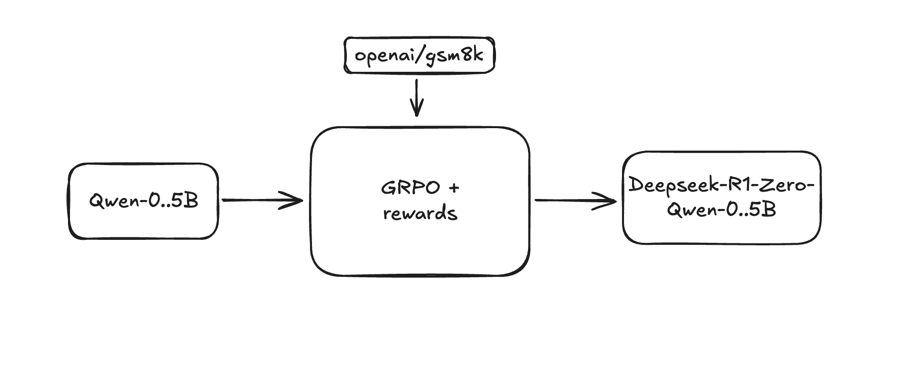

# deepseek-r1-qwen2.5-0.5b

## Overview
This repository contains code for fine-tuning the Qwen2.5-0.5B-Instruct model using GRPO (Gradient-based Reward Policy Optimization) on the GSM8K dataset.

## Model Details
- Base Model: Qwen/Qwen2.5-0.5B-Instruct
- Training Method: GRPO (Gradient-based Reward Policy Optimization)
- Dataset: GSM8K (Grade School Math 8K)

## Training Configuration
- Learning Rate: 5e-6
- Batch Size: 32
- Gradient Accumulation Steps: 4
- Training Epochs: 1
- Mixed Precision: BF16

## Reward Functions
The model is trained using multiple reward functions:
1. XML Format Counting: Validates proper XML tag structure
2. Soft Format: Checks for basic XML tag presence
3. Strict Format: Enforces exact XML formatting
4. Integer Check: Verifies numerical answers
5. Correctness: Compares extracted answers with ground truth

## Response Format
The model is trained to respond in the following format:

<reasoning>
[Step-by-step solution]
</reasoning>
<answer>
[Final numerical answer]
</answer>
